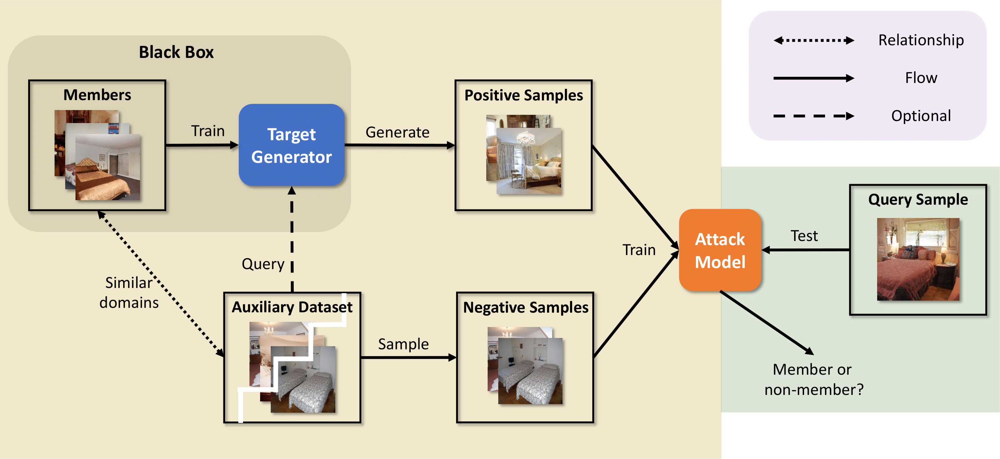

# Generated Distributions Are All You Need for Membership Inference Attacks Against Generative Models

Code for our paper *Generated Distributions Are All You Need for Membership Inference Attacks Against Generative Models* by [Minxing Zhang](https://scholar.google.com/citations?user=wsSLja0AAAAJ&hl=en&oi=ao), [Ning Yu](https://scholar.google.com/citations?user=TaJND9YAAAAJ&hl=en&oi=ao), [Rui Wen](https://scholar.google.com/citations?user=Fym-rLUAAAAJ&hl=en&oi=ao), [Michael Backes](https://scholar.google.com/citations?user=ZVS3KOEAAAAJ&hl=en&oi=ao), and [Yang Zhang](https://scholar.google.com/citations?user=Xeb2888AAAAJ&hl=en&oi=ao).



### Abstract

Generative models have demonstrated revolutionary success in various visual creation tasks, but in the meantime, they have been exposed to the threat of leaking private information of their training data. Several membership inference attacks (MIAs) have been proposed to exhibit the privacy vulnerability of generative models by classifying a query image as a training dataset member or nonmember. However, these attacks suffer from major limitations, such as requiring shadow models and white-box access, and either ignoring or only focusing on the unique property of diffusion models, which block their generalization to multiple generative models. In contrast, we propose the first generalized membership inference attack against a variety of generative models such as generative adversarial networks,[variational] autoencoders, implicit functions, and the emerging diffusion models. We leverage only generated distributions from target generators and auxiliary non-member datasets, therefore regarding target generators as black boxes and agnostic to their architectures or application scenarios. Experiments validate that all the generative models are vulnerable to our attack. For instance, our work achieves attack AUC> 0.99 against DDPM, DDIM, and FastDPM trained on CIFAR-10 and CelebA. And the attack against VQGAN, LDM (for the text-conditional generation), and LIIF achieves AUC> 0.90. As a result, we appeal to our community to be aware of such privacy leakage risks when designing and publishing generative models.

### News

April 22, 2024 - We upload our code of the black-box membership inference attack.

### Usage

```
python BlackboxAttack.py \
        --train-in-path <The path of the training positives> \
        --train-out-path <The path of the training negatives> \
        --test-in-path <The path of the testing positives> \
        --test-out-path <The path of the testing negatives>
```
